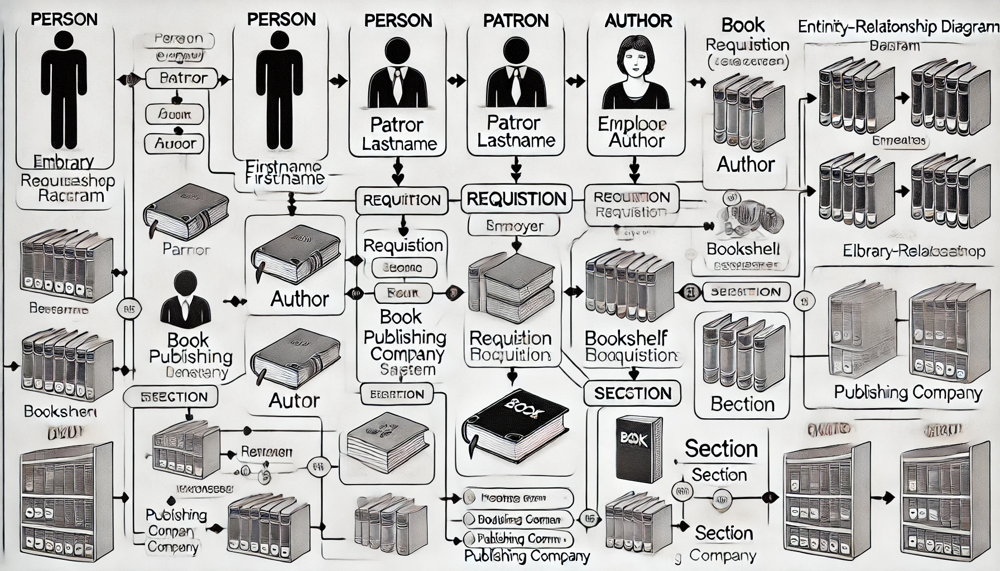
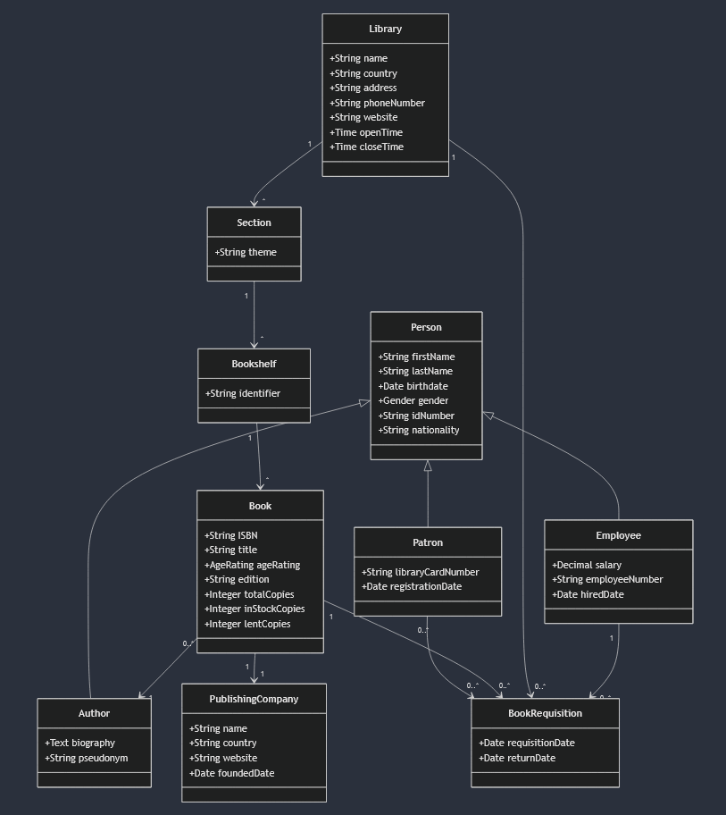

# Index


- [Index](#index)
- [Project Description](#project-description)
  - [Initial Description](#initial-description)
  - [After Generative AI Analysis](#after-generative-ai-analysis)
  - [Updated Description](#updated-description)
- [1. Database](#1-database)
  - [1.1. Classes and Attributes](#11-classes-and-attributes)
    - [*Person*](#person)
    - [*Patron (Child of Person)*](#patron-child-of-person)
    - [*Employee (Child of Person)*](#employee-child-of-person)
    - [*Section*](#section)
    - [*Bookshelf*](#bookshelf)
    - [*Book*](#book)
    - [*Requisition*](#requisition)
    - [*Author (Child of Person)*](#author-child-of-person)
    - [*Publishing Company*](#publishing-company)
- [2. UML Diagram](#2-uml-diagram)
  - [2.1 Refined Model](#21-refined-model)
  - [2.2 Generative AI Integration](#22-generative-ai-integration)
  - [2.3 Final Model](#23-final-model)
- [3. Relational Schema](#3-relational-schema)
  - [3.1 Initial Proposal](#31-initial-proposal)
  - [3.2 Generative AI Assistance](#32-generative-ai-assistance)
  - [3.3 Final Proposal](#33-final-proposal)
    - [Main Entities](#main-entities)
    - [Inheritance (Specialized Entities)](#inheritance-specialized-entities)
    - [Relationships](#relationships)
- [4. Functional Dependencies and Normal Form Analysis](#4-functional-dependencies-and-normal-form-analysis)
  - [4.1 Functional Dependencies](#41-functional-dependencies)
  - [4.2 Normalization](#42-normalization)
  - [4.3 Generative AI Assistance](#43-generative-ai-assistance)
      - [Response](#response)
  - [4.4 Final Proposal](#44-final-proposal)
- [5. SQLite Database Creation](#5-sqlite-database-creation)
  - [5.1 Initial Proposal](#51-initial-proposal)
  - [5.2 Generative AI Integration](#52-generative-ai-integration)
  - [5.3 Final Proposal](#53-final-proposal)
- [6. SQLite Data Loading (Populate)](#6-sqlite-data-loading-populate)
  - [6.1 Initial Proposal and Generative AI Integration](#61-initial-proposal-and-generative-ai-integration)
  - [6.2 Final Proposal](#62-final-proposal)
- [7. Conclusions](#7-conclusions)
  - [7.1 Project Overview](#71-project-overview)
  - [7.2 Generative AI Integration Overview](#72-generative-ai-integration-overview)
  - [7.3 Work Load](#73-work-load)

___
___

# Project Description

## Initial Description

- A Public Library is divided into multiple different sections, each one of them pertaining to a specific theme. Each section is composed of a wide range of bookshelves that then store the library’s available books.
- A book has a plethora of properties, those being the ISBN (a numeric identifier), the book’s title as well as the author, the age rating, the printed edition and the publishing company. To manage the books present in the library, these also have the attributes of total copies, in stock copies and lent copies, allowing for the easier management of which books are in store or not.
- Furthermore, the books can be requested/checked out of the library with each of the book’s requisition forms having a request date and a return date.
- The library is home to two types of people, the employees (with an associated employee number) and the patrons (with a library card). Both people are defined by their name, birthdate, gender, and id Number. For a book to be checked out the person must be a patron thus having a library card number to log into the requisition form.

## After Generative AI Analysis

- Using a simple Generative AI tool, like ChatGPT, we input our initial description along with the planned classes and attributes and asked whether the AI would make any changes to our planned database. The AI suggested the normalization of frequently reused entities like Author and Publisher into separate tables. As well as changing a few attribute types and extending them for a broader database. Thus, after proper analysis and comparison of our previous description and the new AI description, we decided to implement most of the features suggested by the AI, resulting in:

## Updated Description

- The Public Library System is an organized information network designed to facilitate access to a vast collection of books.
- At its core the library is composed of _People_, _Books_ and Infrastructure, all interconnected. Key actors include _Patrons_, who borrow books and frequent the library, and _Employees_, who manage operations. Simultaneously, the library collaborates with _Authors_ to showcase their works and _Publishing Companies_ to source books.
- The library has themed _Sections_ designated to categorize books by genre or subject matter. Each section contains multiple _Bookshelves_, uniquely identified to store and display the books effectively.
- The Books are identified by their ISBN, their title and edition, as well as an age rating and stock information to ensure the system manages the requests of patrons. The _Book Requisition_ tracks the borrowing details such as requisition date, return date and references to the associated Patron, Book and Library.
- The people are characterized by their first and last names, birthdate, gender, id number and nationality. With the author having a potential biography and pseudonyms. The Patron has an associated library card number and a registration date. And the employee having a salary, an employee number and a hired date associated.
- Finally, the Publishing Company is defined by its name, country of origin, a possible   website and a foundation date.

___
___

# 1. Database

- This section already implements the changes made after the Generative AI tool had been used.

## 1.1. Classes and Attributes

### *Person*

| Attribute   | Description                        | Constraints                                                                       |
| ----------- | ---------------------------------- | --------------------------------------------------------------------------------- |
| FirstName   | The first name of the person       | NOT NULL                                                                          |
| LastName    | The last name of the person        | NOT NULL                                                                          |
| Birthdate   | The date of birth of the person    | NOT NULL                                                                          |
| Gender      | The gender identity of the person  | = ('Male' OR 'Female' OR 'Non-Binary' OR 'Undisclosed'); DEFAULT is 'Undisclosed' |
| IdNumber    | A unique identifier for the person | NOT NULL, UNIQUE                                                                  |
| Nationality | The nationality of the person      | NOT NULL                                                                          |

___

### *Patron (Child of Person)*

| Attribute         | Description                                     | Constraints                              |
| ----------------- | ----------------------------------------------- | ---------------------------------------- |
| Person Attributes | Inherits attributes from class _Person_         | Inherits constraints from class _Person_ |
| LibraryCardNumber | A card number identifying the patron            | NOT NULL, UNIQUE                         |
| RegistrationDate  | The date the patron registered with the library | ---                                      |

___

### *Employee (Child of Person)*

| Attribute         | Description                             | Constraints                              |
| ----------------- | --------------------------------------- | ---------------------------------------- |
| Person Attributes | Inherits attributes from class _Person_ | Inherits constraints from class _Person_ |
| EmployeeNumber    | An identifier for the employee          | NOT NULL, UNIQUE                         |
| HiredDate         | The date the employee was hired         | ---                                      |
| Salary            | The salary of the employee              | NOT NULL                                 |

___

### *Section*

| Attribute | Description                       | Constraints |
| --------- | --------------------------------- | ----------- |
| Theme     | The theme or genre of the section | NOT NULL    |

___

### *Bookshelf*

| Attribute  | Description                      | Constraints      |
| ---------- | -------------------------------- | ---------------- |
| Identifier | The identifier for the bookshelf | NOT NULL, UNIQUE |

___

### *Book*

| Attribute     | Description                                                     | Constraints                                                       |
| ------------- | --------------------------------------------------------------- | ----------------------------------------------------------------- |
| ISBN          | A unique identifier for the book                                | NOT NULL, UNIQUE                                                  |
| Title         | The title of the book                                           | NOT NULL                                                          |
| AgeRating     | The age suitability of the book                                 | = ('Children' OR 'Teens' OR 'Young Adult' OR 'Adult' OR 'Mature') |
| Edition       | The edition of the book                                         | NOT NULL                                                          |
| TotalCopies   | The total number of copies of the book available in the library | NOT NULL                                                          |
| InStockCopies | The number of copies currently available in the library         | NOT NULL                                                          |
| LentCopies    | The number of copies currently being borrowed                   | NOT NULL                                                          |

- CHECK → InStockCopies + LentCopies = TotalCopies

___

### *Requisition*

| Attribute       | Description                             | Constraints |
| --------------- | --------------------------------------- | ----------- |
| RequisitionDate | The date the book was borrowed          | NOT NULL    |
| ReturnDate      | The date the book is due to be returned | NOT NULL    |

- CHECK → ReturnDate > RequisitionDate (ReturnDate must be later than RequisitionDate)

___

### *Author (Child of Person)*

| Attribute         | Description                                      | Constraints                              |
| ----------------- | ------------------------------------------------ | ---------------------------------------- |
| Person Attributes | Inherits attributes from class _Person_          | Inherits constraints from class _Person_ |
| Biography         | A detailed biography of the author               | NOT NULL                                 |
| Pseudonym         | An alternate name or pen name used by the author | ---                                      |

___

### *Publishing Company*

| Attribute   | Description                                               | Constraints      |
| ----------- | --------------------------------------------------------- | ---------------- |
| Name        | The name of the publishing company                        | NOT NULL, UNIQUE |
| Country     | The country where the publishing company is headquartered | NOT NLL          |
| Website     | The website URL of the company                            | ---              |
| FoundedDate | The date the publishing company was established           | ---              |

___
___

# 2. UML Diagram

## 2.1 Refined Model


## 2.2 Generative AI Integration

- Much like in the Description Part, the Generative AI used was ChatGPT. The prompt given to it was the refined model and the new and improved classes and their attributes. The output was an image generated by DALL-E.



- Since the AI used is not yet the best at dealing with images, the output looks a bit dishevelled, and some parts are not perceptive enough. Making it hard to make out the actual UML Diagram.
- However, since we knew the existence of a coding language used specifically to make diagrams (Mermaid Chart), we asked the AI to convert it. That gave us a UML diagram that was more readable than before but still formed through AI prompts.



- Then to clear up the diagram we used the examples provided by the AI and our knowledge to get our Final Model.

## 2.3 Final Model


___
___

# 3. Relational Schema

## 3.1 Initial Proposal

- PersonPatron (<ins>idPerson</ins>, firstName, lastName, birthdate, gender, idNumber, nationality, libraryCardNumber, registrationDate)
- PersonEmployee (<ins>idPerson</ins>, firstName, lastName, birthdate, gender, idNumber, nationality, employeeNumber, salary, hiredDate)
- PersonAuthor (<ins>idPerson</ins>, firstName, lastName, birthdate, gender, idNumber, nationality, biography, pseudonym)
- Section (<ins>idSection</ins>, theme)
- Bookshelf (<ins>identifier</ins>, idSection → Section)
- Book (<ins>isbn</ins>, title, ageRating, edition, totalCopies, inStockCopies, lentCopies, idPublishingCompany → PublishingCompany, identifier → Bookshelf)
- Requisition (<ins>idRequisition</ins>, requisitionDate, returnDate)
- PublishingCompany (<ins>idPublishingCompany</ins>, name, country, website, foundedDate)
- PatronRequisition (<ins>idPatron</ins> → Patron, <ins>idRequisition</ins> → Requisition)
- EmployeeRequisition (<ins>idEmployee</ins>→ Employee, <ins>idRequisition</ins> → Requisition)
- EmployeeRequisition (<ins>idEmployee</ins> → Employee, <ins>idRequisition</ins> → Requisition)
- BookRequisition (<ins>isbn</ins> → Book, <ins>idRequisition</ins> → Requisition)
- BookAuthor (<ins>isbn</ins> → Book, <ins>idPerson</ins> → PersonAuthor)

> Note: Generalizations were made as Object Oriented

---

## 3.2 Generative AI Assistance

- This time the prompt given to the AI was the 1.1 section, the classes, attributes and constrains, as well as the final UML Model. Then we gave the AI our initial proposal for the Relational Schema and simple prompted it with the question:

> Can you detect any mistakes in this relational schema and what would you implement to improve it?

The AI replied saying that the schema was already well structured but that there were a few improvements/changes it would make to enhance clarity and improve normalization. These changes were:

- Splitting Person into a Base Relation and making PersonPatron, PersonEmployee and PersonAuthor extend it.
- Remove PatronRequisition and EmployeeRequisition since each requisition is already tied to a specific patron and employee via idPatron and idEmployee in the Requisition Relation.
- Improve Naming for Consistency and remove redundancy.
- Change Book and Bookshelf Primary Keys for flexibility and future-proofing.

---

## 3.3 Final Proposal

### Main Entities

- **Person** (<ins>idPerson</ins>, firstName, lastName, birthdate, gender, idNumber, nationality)
- **Section** (<ins>idSection</ins>, theme)
- **Bookshelf** (<ins>idBookshelf</ins>, identifier, idSection → Section)
- **Book** (<ins>idBook</ins>, isbn, title, ageRating, edition, totalCopies, inStockCopies, lentCopies, idPublishingCompany → PublishingCompany, idBookshelf → Bookshelf)
- **Requisition** (<ins>idRequisition</ins>, requisitionDate, returnDate, idPatron → Patron, idEmployee → Employee)
- **PublishingCompany** (<ins>idPublishingCompany</ins>, name, country, website, foundedDate)

---

### Inheritance (Specialized Entities)

- **Patron** (<ins>idPerson</ins> → Person, libraryCardNumber, registrationDate)
- **Employee** (<ins>idPerson</ins> → Person, employeeNumber, salary, hiredDate)
- **Author** (<ins>idPerson</ins> → Person, biography, pseudonym)

---

### Relationships

- **BookAuthor** (<ins>idBook</ins> → Book, <ins>idPerson</ins> → Author)
- **BookRequisition** (<ins>idBook</ins> → Book, <ins>idRequisition</ins> → Requisition)

____
___

# 4. Functional Dependencies and Normal Form Analysis

## 4.1 Functional Dependencies

- Each dependency is structured as such:

| Relation                      | Relation Name  |
| ----------------------------- | -------------- |
| Keys                          | Candidate Keys |
| Functional Dependencies (FDs) | ---            |
| Justification + Decomposition | ---            |

___

>Person

| Relation                      | Person                                                                                                            |
| ----------------------------- | ----------------------------------------------------------------------------------------------------------------- |
| Keys                          | `idPerson`                                                                                                        |
| Functional Dependencies (FDs) | `idPerson → firstName, lastName, birthdate, gender, idNumber, nationality`                                        |
| Justification + Decomposition | `idPerson` is the primary key, ensuring all attributes are functionally dependent on it. No decomposition needed. |
...

> Section

| Relation                      | Section                                                                                                    |
| ----------------------------- | ---------------------------------------------------------------------------------------------------------- |
| Keys                          | `idSection`                                                                                                |
| Functional Dependencies (FDs) | `idSection → theme`                                                                                        |
| Justification + Decomposition | `idSection` is the primary key, and it uniquely identifies `theme`. Therefore, no decomposition is needed. |

...

> Bookshelf

| Relation                      | Bookshelf                                                                                                         |
| ----------------------------- | ----------------------------------------------------------------------------------------------------------------- |
| Keys                          | `idBookshelf`                                                                                                     |
| Functional Dependencies (FDs) | `idBookshelf → identifier`                                                                                        |
| Justification + Decomposition | `idBookshelf` is the primary key, and it uniquely identifies `identifier`. Therefore, no decomposition is needed. |

...

> Book

| Relation                      | Book                                                                                                                                 |
| ----------------------------- | ------------------------------------------------------------------------------------------------------------------------------------ |
| Keys                          | `idBook`                                                                                                                             |
| Functional Dependencies (FDs) | `idBook → isbn, title, ageRating, edition, totalCopies, inStockCopies, lentCopies`                                                   |
| Justification + Decomposition | `idBook` is the primary key, ensuring all attributes depend on it. `isbn`is unique but not the primary key. No decomposition needed. |

...

> Requisition

| Relation                      | Requisition                                                                                 |
| ----------------------------- | ------------------------------------------------------------------------------------------- |
| Keys                          | `idRequisition`                                                                             |
| Functional Dependencies (FDs) | `idRequisition → requisitionDate, returnDate`                                               |
| Justification + Decomposition | `idRequisition`  uniquely identifies all attributes. Therefore, no decomposition is needed. |

...

> PublishingCompany

| Relation                      | PublishingCompany                                                                                             |
| ----------------------------- | ------------------------------------------------------------------------------------------------------------- |
| Keys                          | `idPublishingCompany`                                                                                         |
| Functional Dependencies (FDs) | `idPublishingCompany → name, country, website, foundedDate`                                                   |
| Justification + Decomposition | `idPublishingCompany` uniquely identifies all attributes of the publishing company.  No decomposition needed. |

...

> Patron

| Relation                      | Patron                                                                                                                                             |
| ----------------------------- | -------------------------------------------------------------------------------------------------------------------------------------------------- |
| Keys                          | `idPerson`                                                                                                                                         |
| Functional Dependencies (FDs) | `idPerson → libraryCardNumber, registrationDate`                                                                                                   |
| Justification + Decomposition | `idPerson` (inheritance from `Person`) ensures that is the primary key, and it uniquely identifies patrons. Therefore, no decomposition is needed. |

...

> Employee

| Relation                      | Employee                                                                                                                                             |
| ----------------------------- | ---------------------------------------------------------------------------------------------------------------------------------------------------- |
| Keys                          | `idPerson`                                                                                                                                           |
| Functional Dependencies (FDs) | `idPerson → employeeNumber, salary, hiredDate`                                                                                                       |
| Justification + Decomposition | `idPerson` (inheritance from `Person`) ensures that is the primary key, and it uniquely identifies employees. Therefore, no decomposition is needed. |
...

> Author

| Relation                      | Author                                                                                                                                             |
| ----------------------------- | -------------------------------------------------------------------------------------------------------------------------------------------------- |
| Keys                          | `idPerson`                                                                                                                                         |
| Functional Dependencies (FDs) | `idPerson → biography, pseudonym`                                                                                                                  |
| Justification + Decomposition | `idPerson` (inheritance from `Person`) ensures that is the primary key, and it uniquely identifies authors. Therefore, no decomposition is needed. |
...

> BookAuthor

| Relation                      | BookAuthor                                                                                                                    |
| ----------------------------- | ----------------------------------------------------------------------------------------------------------------------------- |
| Keys                          | `(idBook, idPerson)`                                                                                                          |
| Functional Dependencies (FDs) | `idBook, idPerson → (no additional attributes)`                                                                               |
| Justification + Decomposition | Composite key  `(idBook, idPerson)` ensures the many-to-many relationship between books and authors. No decomposition needed. |

...

> BookRequisition

| Relation                      | BookRequisition                                                                                                                         |
| ----------------------------- | --------------------------------------------------------------------------------------------------------------------------------------- |
| Keys                          | `(idBook, idRequisition)`                                                                                                               |
| Functional Dependencies (FDs) | `idBook, idRequisition → (no additional attributes)`                                                                                    |
| Justification + Decomposition | Composite key  `(idBook, idRequisition)` ensures the many-to-many relationship between books and requisitions. No decomposition needed. |

___

## 4.2 Normalization

- **1NF** (First Normal Form) → Domain of each attribute contains only atomic values and the value of each attribute contains only a single value from that domain.

- **2NF** (First Normal Form) → 1NF and no attribute not prime is functionally dependent on a proper subset of a candidate key.

- **3NF** (First Normal Form) → 2NF and all attributes depend only on the primary key, and there are no transitive dependencies.

- **BCNF** → All functional dependencies have their left-hand side as a super key. (A more strict **3NF**)

> After a thorough analysis of the schema and functional dependencies, we determined that the schema is already normalized up to **3NF**, ensuring both structural integrity and minimal redundancy. At the same time, the schema also complies with the **BCNF** structure.

___

## 4.3 Generative AI Assistance

- This time, the AI was given the Functional Dependencies described above and the Normalization conclusion. As well as the previously adapted relational schema. The prompt given was the following:

> Based On the Relational Schema definition, analyse the functional dependencies and normal forms also submitted. In the analysis, indicate if there is any changes you'd make to improve on it, or any fixes to incorrect sections.

#### Response

- The functional dependencies and normalization up to BCNF are well-structured, Here's possible suggestions for improvement:

1. _Bookshelf_ → Add the FD `idBookshelf → idSection` explicitly to capture the relationship between `Bookshelf` and `Section`. This ensures clarity in the dependency. If `identifier` is unique across all bookshelves, explicitly note `identifier → idBookshelf`.
2. _Book_ → Add `idBook → idPublishingCompany` and `idBook → Bookshelf` to include relationships that are implied but not directly stated. If `isbn` is globally unique add: `isbn → idBook, title, ageRating, edition, totalCopies, inStockCopies, lentCopies`.
3. _BookAuthor_ and _BookRequisition_ → Clarify these as **associative entities** in the documentations to ensure the FDs reflet their roles in linking two entities without additional dependencies.
4. _Patron, Employee_ and _Author_ → Clarify that `idPerson` retains the inherited attributes from `Person`, ensuring it remains functionally complete for each specialization. This would avoid any accidental  FD gaps in inheritance.
5. _Requisition_ → If a `Patron` and an `Employee` are always associated with a `Requisition`, add `idRequisition → idPatron` and `idRequisition → idEmployee` to better reflect this dependency.

___

## 4.4 Final Proposal

> Person

| Relation                      | Person                                                                                                            |
| ----------------------------- | ----------------------------------------------------------------------------------------------------------------- |
| Keys                          | `idPerson`                                                                                                        |
| Functional Dependencies (FDs) | `idPerson → firstName, lastName, birthdate, gender, idNumber, nationality`                                        |
| Justification + Decomposition | `idPerson` is the primary key, ensuring all attributes are functionally dependent on it. No decomposition needed. |

---

> Section

| Relation                      | Section                                                                                                    |
| ----------------------------- | ---------------------------------------------------------------------------------------------------------- |
| Keys                          | `idSection`                                                                                                |
| Functional Dependencies (FDs) | `idSection → theme`                                                                                        |
| Justification + Decomposition | `idSection` is the primary key, and it uniquely identifies `theme`. Therefore, no decomposition is needed. |

---

> Bookshelf

| Relation                      | Bookshelf                                                                                                                                                    |
| ----------------------------- | ------------------------------------------------------------------------------------------------------------------------------------------------------------ |
| Keys                          | `idBookshelf`                                                                                                                                                |
| Functional Dependencies (FDs) | `idBookshelf → identifier, idSection`<br>`identifier → idBookshelf` (`identifier` is globally unique)                                                        |
| Justification + Decomposition | `idBookshelf` uniquely identifies both `identifier` and `idSection`. Explicitly capturing `idBookshelf → idSection` clarifies the relationship to `Section`. |

---

> Book

| Relation                      | Book                                                                                                                                                                                                                                   |
| ----------------------------- | -------------------------------------------------------------------------------------------------------------------------------------------------------------------------------------------------------------------------------------- |
| Keys                          | `idBook`                                                                                                                                                                                                                               |
| Functional Dependencies (FDs) | `idBook → isbn, title, ageRating, edition, totalCopies, inStockCopies, lentCopies, idPublishingCompany, idBookshelf`<br>`isbn → idBook, title, ageRating, edition, totalCopies, inStockCopies, lentCopies` (`isbn` is globally unique) |
| Justification + Decomposition | `idBook` is the primary key, and all attributes depend on it. Relationships to `PublishingCompany` and `Bookshelf` are explicitly stated. No decomposition needed.                                                                     |

---

> Requisition

| Relation                      | Requisition                                                                                                           |
| ----------------------------- | --------------------------------------------------------------------------------------------------------------------- |
| Keys                          | `idRequisition`                                                                                                       |
| Functional Dependencies (FDs) | `idRequisition → requisitionDate, returnDate, idPatron, idEmployee`                                                   |
| Justification + Decomposition | `idRequisition` uniquely identifies all attributes, including associations to `Patron` and `Employee`. No decomposition is needed. |

---

> PublishingCompany

| Relation                      | PublishingCompany                                                                                             |
| ----------------------------- | ------------------------------------------------------------------------------------------------------------- |
| Keys                          | `idPublishingCompany`                                                                                         |
| Functional Dependencies (FDs) | `idPublishingCompany → name, country, website, foundedDate`                                                   |
| Justification + Decomposition | `idPublishingCompany` uniquely identifies all attributes of the publishing company.  No decomposition needed. |

---

> Patron

| Relation                      | Patron                                                                                                                                             |
| ----------------------------- | -------------------------------------------------------------------------------------------------------------------------------------------------- |
| Keys                          | `idPerson`                                                                                                                                         |
| Functional Dependencies (FDs) | `idPerson → libraryCardNumber, registrationDate`                                                                                                   |
| Justification + Decomposition | `idPerson` (inheritance from `Person`) ensures that it is the primary key and uniquely identifies patrons. All inherited and specialized attributes are functionally dependent. |

---

> Employee

| Relation                      | Employee                                                                                                                                             |
| ----------------------------- | ---------------------------------------------------------------------------------------------------------------------------------------------------- |
| Keys                          | `idPerson`                                                                                                                                           |
| Functional Dependencies (FDs) | `idPerson → employeeNumber, salary, hiredDate`                                                                                                       |
| Justification + Decomposition | `idPerson` (inheritance from `Person`) ensures that it is the primary key and uniquely identifies employees. All inherited and specialized attributes are functionally dependent. |

---

> Author

| Relation                      | Author                                                                                                                                             |
| ----------------------------- | -------------------------------------------------------------------------------------------------------------------------------------------------- |
| Keys                          | `idPerson`                                                                                                                                         |
| Functional Dependencies (FDs) | `idPerson → biography, pseudonym`                                                                                                                  |
| Justification + Decomposition | `idPerson` (inheritance from `Person`) ensures that it is the primary key and uniquely identifies authors. All inherited and specialized attributes are functionally dependent. |

---

> BookAuthor

| Relation                      | BookAuthor                                                                                                                    |
| ----------------------------- | ----------------------------------------------------------------------------------------------------------------------------- |
| Keys                          | `(idBook, idPerson)`                                                                                                          |
| Functional Dependencies (FDs) | `idBook, idPerson → (no additional attributes)`                                                                               |
| Justification + Decomposition | Composite key `(idBook, idPerson)` ensures the many-to-many relationship between books and authors. No decomposition needed. |

---

> BookRequisition

| Relation                      | BookRequisition                                                                                                                         |
| ----------------------------- | --------------------------------------------------------------------------------------------------------------------------------------- |
| Keys                          | `(idBook, idRequisition)`                                                                                                               |
| Functional Dependencies (FDs) | `idBook, idRequisition → (no additional attributes)`                                                                                    |
| Justification + Decomposition | Composite key `(idBook, idRequisition)` ensures the many-to-many relationship between books and requisitions. No decomposition needed. |

- Since even in the initial functional dependency analysis, all the functional  dependencies oblige by the **3NF** normalization and even the **BCNF** system, the final functional dependencies also follow the same model, all being **3NF** and **BCNF**.

 1. All functional dependencies adhere to the rules of **full functional dependency** (_3NF_).
 2. The **left-hand side of every functional dependency** is a superkey in each relation, making the schema conform to **BCNF**.

___
___

# 5. SQLite Database Creation

## 5.1 Initial Proposal

- Based on the final Relational Schema proposal, the following database was made in `sqlite3`.

create1.sql

```sql
-- Commands for Database  
PRAGMA foreign_keys = ON;  
  
.mode column  
.headers on  
  
-- Drop Existing Tables/Relations  
  
DROP TABLE IF EXISTS Person;  
DROP TABLE IF EXISTS Section;  
DROP TABLE IF EXISTS Bookshelf;  
DROP TABLE IF EXISTS Book;  
DROP TABLE IF EXISTS Requisition;  
DROP TABLE IF EXISTS PublishingCompany;  
DROP TABLE IF EXISTS Patron;  
DROP TABLE IF EXISTS Employee;  
DROP TABLE IF EXISTS Author;  
DROP TABLE IF EXISTS BookAuthor;  
DROP TABLE IF EXISTS BookRequisition;  
  
-- Creating Tables  
  
-- Main Entities  
  
CREATE TABLE Person (  
    idPerson INTEGER PRIMARY KEY,  
    firstName VARCHAR(50) NOT NULL,  
    lastName VARCHAR(50) NOT NULL,  
    birthdate DATE NOT NULL,  
    gender TEXT CHECK(gender IN ('Male', 'Female', 'Non-Binary', 'Undisclosed')) NOT NULL DEFAULT 'Undisclosed',  
    idNumber VARCHAR(20) NOT NULL UNIQUE,  
    nationality VARCHAR(50)  
);  
  
CREATE TABLE Section (  
    idSection INTEGER PRIMARY KEY,  
    theme VARCHAR(50) NOT NULL  
);  
  
CREATE TABLE Bookshelf (  
    idBookshelf INTEGER PRIMARY KEY AUTOINCREMENT,  
    identifier VARCHAR(3) NOT NULL UNIQUE,  
    idSection INTEGER NOT NULL,  
    FOREIGN KEY (idSection) REFERENCES Section(idSection)  
);  
  
CREATE TABLE Book (  
    idBook INTEGER PRIMARY KEY AUTOINCREMENT,  
    isbn VARCHAR(17) NOT NULL UNIQUE,  
    title VARCHAR(100) NOT NULL,  
    ageRating TEXT CHECK ( ageRating IN ('Children', 'Teens', 'Young Adult', 'Adult', 'Mature')) NOT NULL,  
    edition VARCHAR(10) NOT NULL,  
    totalCopies NUMERIC(3) NOT NULL,  
    inStockCopies NUMERIC(3) NOT NULL,  
    lentCopies NUMERIC(3) NOT NULL,  
    idPublishingCompany INTEGER NOT NULL,  
    idBookshelf INTEGER NOT NULL,  
    FOREIGN KEY (idPublishingCompany) REFERENCES PublishingCompany(idPublishingCompany),  
    FOREIGN KEY (idBookshelf) REFERENCES Bookshelf(idBookshelf),  
    CHECK ( inStockCopies + lentCopies = totalCopies )  
);  
  
CREATE TABLE Requisition (  
    idRequisition INTEGER PRIMARY KEY,  
    requisitionDate DATE NOT NULL,  
    returnDate DATE NOT NULL,  
    idPatron INTEGER NOT NULL,  
    idEmployee INTEGER NOT NULL,  
    FOREIGN KEY (idPatron) REFERENCES Patron(idPerson),  
    FOREIGN KEY (idEmployee) REFERENCES Employee(idPerson),  
    CHECK ( returnDate > requisitionDate )  
);  
  
CREATE TABLE PublishingCompany (  
    idPublishingCompany INTEGER PRIMARY KEY,  
    name VARCHAR(100) NOT NULL UNIQUE,  
    country VARCHAR(3), -- ISO country code format  
    website VARCHAR(255),  
    foundedDate DATE  
);  
  
-- Inheritance (Specialized Entities)  
  
CREATE TABLE Patron (  
    idPerson INTEGER PRIMARY KEY,  
    libraryCardNumber VARCHAR(10) NOT NULL UNIQUE,  
    registrationDate DATE,  
    FOREIGN KEY (idPerson) REFERENCES Person(idPerson)  
);  
  
CREATE TABLE Employee (  
    idPerson INTEGER PRIMARY KEY,  
    employeeNumber NUMERIC(10) NOT NULL UNIQUE,  
    salary DECIMAL(8,2) NOT NULL,  
    hiredDate DATE,  
    FOREIGN KEY (idPerson) REFERENCES Person(idPerson)  
);  
  
CREATE TABLE Author (  
    idPerson INTEGER PRIMARY KEY,  
    biography TEXT NOT NULL,  
    pseudonym VARCHAR(100),  
    FOREIGN KEY (idPerson) REFERENCES Person(idPerson)  
);  
  
-- Relationships  
  
CREATE TABLE BookAuthor (  
    idBook INTEGER,  
    idPerson INTEGER,  
    PRIMARY KEY (idBook, idPerson),  
    FOREIGN KEY (idBook) REFERENCES Book(idBook),  
    FOREIGN KEY (idPerson) REFERENCES Person(idPerson)  
);  
  
CREATE TABLE BookRequisition (  
    idBook INTEGER,  
    idRequisition INTEGER,  
    PRIMARY KEY (idBook, idRequisition),  
    FOREIGN KEY (idBook) REFERENCES Book(idBook),  
    FOREIGN KEY (idRequisition) REFERENCES Requisition(idRequisition)  
);
```

## 5.2 Generative AI Integration

- Once again the Generative AI was used in order to correct any mistakes and overall improve the quality of the code. The following were the tips provided by the AI to make the sql code more robust and scalable:
  - Enable Cascading Deletes and Updates → Add `ON DELETE CASCADE` and `on UPDATE CASCADE` to foreign key constraints to ensure that related data remains consistent when a parent row is deleted/updated.
  - Check Constraints on Person → add constraint to ensure valid dates and non-empty values  for attributes like birthdate.
  - Check for salary and hiredDate in Employee → add check to ensure salary is non-negative and hiredDate is not in the future.
  - Add `AUTOINCREMENT` to Main Entities Primary Keys.
  - Change Nationality to store ISO country codes.
  - Increase Size for edition, totalCopies, inStockCopies and lent Copies.

## 5.3 Final Proposal

- Overall the changes made were the ones suggested by the AI, since, in our point of view most of them did not alter the essence of our relational model but instead just made the database more scalable and robust. Mainly being able to check for certain constraints that weren't thought of before.

create2.sql

```sql
-- Commands for Database  
PRAGMA foreign_keys = ON;  
  
.mode column  
.headers on  
  
-- Drop Existing Tables/Relations  
DROP TABLE IF EXISTS Person;  
DROP TABLE IF EXISTS Section;  
DROP TABLE IF EXISTS Bookshelf;  
DROP TABLE IF EXISTS Book;  
DROP TABLE IF EXISTS Requisition;  
DROP TABLE IF EXISTS PublishingCompany;  
DROP TABLE IF EXISTS Patron;  
DROP TABLE IF EXISTS Employee;  
DROP TABLE IF EXISTS Author;  
DROP TABLE IF EXISTS BookAuthor;  
DROP TABLE IF EXISTS BookRequisition;  
  
-- Creating Tables  
  
-- Main Entities  
  
CREATE TABLE Person (  
    idPerson INTEGER PRIMARY KEY AUTOINCREMENT,  
    firstName VARCHAR(50) NOT NULL,  
    lastName VARCHAR(50) NOT NULL,  
    birthdate DATE NOT NULL CHECK (birthdate <= CURRENT_DATE),  -- Ensure birthdate is a valid date and not in the future  
    gender TEXT CHECK(gender IN ('Male', 'Female', 'Non-Binary', 'Undisclosed')) NOT NULL DEFAULT 'Undisclosed',  
    idNumber VARCHAR(20) NOT NULL UNIQUE,  
    nationality VARCHAR(3) NOT NULL -- ISO 3166-1 alpha-3 country code  
);  
  
CREATE TABLE Section (  
    idSection INTEGER PRIMARY KEY AUTOINCREMENT,  
    theme VARCHAR(50) NOT NULL  
);  
  
CREATE TABLE Bookshelf (  
    idBookshelf INTEGER PRIMARY KEY AUTOINCREMENT,  
    identifier VARCHAR(3) NOT NULL UNIQUE,  
    idSection INTEGER,  
    FOREIGN KEY (idSection) REFERENCES Section(idSection) ON DELETE CASCADE ON UPDATE CASCADE  
);  
  
CREATE TABLE Book (  
    idBook INTEGER PRIMARY KEY AUTOINCREMENT,  
    isbn VARCHAR(17) NOT NULL UNIQUE,  
    title VARCHAR(100) NOT NULL,  
    ageRating TEXT CHECK (ageRating IN ('Children', 'Teens', 'Young Adult', 'Adult', 'Mature')) NOT NULL,  
    edition VARCHAR(20) NOT NULL,  -- Increased size for editions  
    totalCopies NUMERIC(5) NOT NULL,  -- Increased size for larger numbers of copies  
    inStockCopies NUMERIC(5) NOT NULL,  
    lentCopies NUMERIC(5) NOT NULL,  
    idPublishingCompany INTEGER,  
    idBookshelf INTEGER,  
    FOREIGN KEY (idPublishingCompany) REFERENCES PublishingCompany(idPublishingCompany) ON DELETE CASCADE ON UPDATE CASCADE,  
    FOREIGN KEY (idBookshelf) REFERENCES Bookshelf(idBookshelf) ON DELETE CASCADE ON UPDATE CASCADE,  
    CHECK (inStockCopies + lentCopies = totalCopies)  
);  
  
CREATE TABLE Requisition (  
    idRequisition INTEGER PRIMARY KEY AUTOINCREMENT,  
    requisitionDate DATE NOT NULL,  
    returnDate DATE NOT NULL CHECK (returnDate > requisitionDate),  -- Ensuring returnDate is after requisitionDate  
    idPatron INTEGER,  
    idEmployee INTEGER,  
    FOREIGN KEY (idPatron) REFERENCES Patron(idPerson) ON DELETE CASCADE ON UPDATE CASCADE,  
    FOREIGN KEY (idEmployee) REFERENCES Employee(idPerson) ON DELETE CASCADE ON UPDATE CASCADE  
);  
  
CREATE TABLE PublishingCompany (  
    idPublishingCompany INTEGER PRIMARY KEY AUTOINCREMENT,  
    name VARCHAR(100) NOT NULL UNIQUE,  
    country VARCHAR(3), -- ISO country code format  
    website VARCHAR(255),  
    foundedDate DATE  
);  
  
-- Inheritance (Specialized Entities)  
  
CREATE TABLE Patron (  
    idPerson INTEGER PRIMARY KEY,  
    libraryCardNumber VARCHAR(10) NOT NULL UNIQUE,  
    registrationDate DATE,  
    FOREIGN KEY (idPerson) REFERENCES Person(idPerson) ON DELETE CASCADE ON UPDATE CASCADE  
);  
  
CREATE TABLE Employee (  
    idPerson INTEGER PRIMARY KEY,  
    employeeNumber NUMERIC(10) NOT NULL UNIQUE,  
    salary DECIMAL(8,2) NOT NULL CHECK (salary >= 0),  -- Ensure salary is non-negative  
    hiredDate DATE NOT NULL CHECK (hiredDate <= CURRENT_DATE),  -- Ensure hiredDate is not in the future  
    FOREIGN KEY (idPerson) REFERENCES Person(idPerson) ON DELETE CASCADE ON UPDATE CASCADE  
);  
  
CREATE TABLE Author (  
    idPerson INTEGER PRIMARY KEY,  
    biography TEXT NOT NULL,  
    pseudonym VARCHAR(100),  
    FOREIGN KEY (idPerson) REFERENCES Person(idPerson) ON DELETE CASCADE ON UPDATE CASCADE  
);  
  
-- Relationships  
  
CREATE TABLE BookAuthor (  
    idBook INTEGER,  
    idPerson INTEGER,  
    PRIMARY KEY (idBook, idPerson),  
    FOREIGN KEY (idBook) REFERENCES Book(idBook) ON DELETE CASCADE ON UPDATE CASCADE,  
    FOREIGN KEY (idPerson) REFERENCES Person(idPerson) ON DELETE CASCADE ON UPDATE CASCADE  
);  
  
CREATE TABLE BookRequisition (  
     idBook INTEGER,  
     idRequisition INTEGER,  
     PRIMARY KEY (idBook, idRequisition),  
     FOREIGN KEY (idBook) REFERENCES Book(idBook) ON DELETE CASCADE ON UPDATE CASCADE,  
     FOREIGN KEY (idRequisition) REFERENCES Requisition(idRequisition) ON DELETE CASCADE ON UPDATE CASCADE  
);
```

> Note : all files are included in the project folder. (create1.sql and create2.sql)
___
___

# 6. SQLite Data Loading (Populate)

## 6.1 Initial Proposal and Generative AI Integration

- To start off the population of the database, some values pertaining to our database were input by ourselves.

populate1.sql

```sql
-- Enable Foreign Key Support  
PRAGMA foreign_keys = ON;  
  
  
---  
  
INSERT INTO Person (idPerson, firstName, lastName, birthdate, gender, idNumber, nationality) VALUES (1, 'John', 'Doe', '1990-01-01', 'Male','12345678', 'UK');  
INSERT INTO Person (idPerson, firstName, lastName, birthdate, gender, idNumber, nationality) VALUES (2, 'Mary', 'Smith', '1999-12-31', 'Female','12345679', 'USA');  
INSERT INTO Person (idPerson, firstName, lastName, birthdate, gender, idNumber, nationality) VALUES (3, 'Maurice', 'Sendak', '1928-06-10', 'Male','22334455', 'USA');  
INSERT INTO Person (idPerson, firstName, lastName, birthdate, gender, idNumber, nationality) VALUES (4, 'Alice', 'Oseman', '1994-10-16', 'Female','123123123', 'UK');  
INSERT INTO Person (idPerson, firstName, lastName, birthdate, gender, idNumber, nationality) VALUES (5, 'John', 'Green', '1977-08-24', 'Male','678876678', 'USA');  
INSERT INTO Person (idPerson, firstName, lastName, birthdate, gender, idNumber, nationality) VALUES (6, 'Taylor', 'Jenkins', '1983-12-20', 'Female','21213434', 'USA');  
INSERT INTO Person (idPerson, firstName, lastName, birthdate, gender, idNumber, nationality) VALUES (7, 'Kentaro', 'Miura', '1966-07-11', 'Male','99999999', 'JP');  
  
--  
  
INSERT INTO Patron(idPerson, libraryCardNumber, registrationDate) VALUES (1,20,'2017-10-10');  
INSERT INTO Employee(idPerson, employeeNumber, salary, hiredDate) VALUES (2,5, 1500.00,'2006-01-05');  
INSERT INTO Author(idPerson, biography, pseudonym) VALUES (3,'Most Famous for writing Where the Wild things Are','');  
INSERT INTO Author(idPerson, biography, pseudonym) VALUES (4,'Most Famous for writing Heartstopper','');  
INSERT INTO Author(idPerson, biography, pseudonym) VALUES (5,'Most Famous for writing The Fault in Our Stars','');  
INSERT INTO Author(idPerson, biography, pseudonym) VALUES (6,'Most Famous for writing The Seven Husbands of Evelyn Hugo','');  
INSERT INTO Author(idPerson, biography, pseudonym) VALUES (7,'Most Famous for writing Berserk','');  
  
---  
  
INSERT INTO Section (idSection, theme) VALUES (1,'Children Picture Book');  
INSERT INTO Section (idSection, theme) VALUES (2,'Graphic Novel');  
INSERT INTO Section (idSection, theme) VALUES (3,'Realistic Fiction');  
INSERT INTO Section (idSection, theme) VALUES (4,'Historical Fiction');  
INSERT INTO Section (idSection, theme) VALUES (5,'Manga');  
  
---  
  
INSERT INTO Bookshelf (idBookshelf, identifier, idSection) VALUES (1, '1S',1);  
INSERT INTO Bookshelf (idBookshelf, identifier, idSection) VALUES (2, '2O',2);  
INSERT INTO Bookshelf (idBookshelf, identifier, idSection) VALUES (3, '3G',3);  
INSERT INTO Bookshelf (idBookshelf, identifier, idSection) VALUES (4, '4J',4);  
INSERT INTO Bookshelf (idBookshelf, identifier, idSection) VALUES (5, '5M',5);  
  
---  
  
INSERT INTO PublishingCompany (idPublishingCompany, name, country, website, foundedDate) VALUES (1, 'Penguin Random House', 'USA','https://www.penguinrandomhouse.com', '2013-07-01');  
INSERT INTO PublishingCompany (idPublishingCompany, name, country, website, foundedDate) VALUES (2, 'Harper Collins', 'USA','https://www.harpercollins.com', '1989-01-01');  
INSERT INTO PublishingCompany (idPublishingCompany, name, country, website, foundedDate) VALUES (3, 'Simon and Schuster', 'USA','https://www.simonandschuster.com/', '1924-01-02');  
INSERT INTO PublishingCompany (idPublishingCompany, name, country, website, foundedDate) VALUES (4, 'Hachette', 'FR','https://hachette.com/en', '1826-01-01');  
INSERT INTO PublishingCompany (idPublishingCompany, name, country, website, foundedDate) VALUES (5, 'Hakusensha', 'JP','https://www.hakusensha.co.jp', '1973-12-01');  
  
---  
  
INSERT INTO Book (idBook, isbn, title, ageRating, edition, totalCopies, inStockCopies, lentCopies, idPublishingCompany, idBookshelf) VALUES (1,'0-06-025492-0','Where the Wild Things Are','Children',25,10,8,2,2,1);  
INSERT INTO Book (idBook, isbn, title, ageRating, edition, totalCopies, inStockCopies, lentCopies, idPublishingCompany, idBookshelf) VALUES (2, '978-1-4449-5138-7','Heartstopper. Volume 1','Teens',2,20,5,15,4,2);  
INSERT INTO Book (idBook, isbn, title, ageRating, edition, totalCopies, inStockCopies, lentCopies, idPublishingCompany, idBookshelf) VALUES (3, '0-525-47881-7','The Fault in Our Stars','Young Adult',10,15,10,5,1,3);  
INSERT INTO Book (idBook, isbn, title, ageRating, edition, totalCopies, inStockCopies, lentCopies, idPublishingCompany, idBookshelf) VALUES (4, '9781398515697','The Seven Husbands of Evelyn Hugo','Adult',8,10,1,9,3,4);  
INSERT INTO Book (idBook, isbn, title, ageRating, edition, totalCopies, inStockCopies, lentCopies, idPublishingCompany, idBookshelf) VALUES (5, '978-1-59307-020-5','Berserk Volume 1','Mature',3,5,3,2,5,5);  
  
---  
  
INSERT INTO Requisition (idRequisition, requisitionDate, returnDate, idPatron, idEmployee) VALUES (1, '2024-11-20', '2024-12-20',1, 2);  
  
---  
  
INSERT INTO BookRequisition (idBook, idRequisition) VALUES (2,1);  
  
---  
  
INSERT INTO BookAuthor (idBook, idPerson) VALUES (1, 3);  
INSERT INTO BookAuthor (idBook, idPerson) VALUES (2, 4);  
INSERT INTO BookAuthor (idBook, idPerson) VALUES (3, 5);  
INSERT INTO BookAuthor (idBook, idPerson) VALUES (4, 6);  
INSERT INTO BookAuthor (idBook, idPerson) VALUES (5, 7);
```

- However, since populating a database can be a quite extensive work, our first inputs were not many. That's where AI is a big help in this part of the project, because unlike us, AI can generate hundreds or thousands of lines of code to populate a database. So that's how the final proposal came to be.

## 6.2 Final Proposal

populate2.sql

```sql
-- Populate Sections  
  
INSERT INTO Section (theme) VALUES  
    ('Thriller'),  
    ('Crime'),  
    ('Romance'),  
    ('Manga'),  
    ('Fantasy'),  
    ('Science Fiction'),  
    ('Non-Fiction'),  
    ('Historical');  
  
-- Populate Bookshelves with correct ids and identifiers  
INSERT INTO Bookshelf (identifier, idSection) VALUES  
    -- Section 1 - Thriller  
    ('1A', 1), ('1B', 1), ('1C', 1), ('1D', 1), ('1E', 1), ('1F', 1), ('1G', 1), ('1H', 1), ('1I', 1),  
    ('1J', 1), ('1K', 1), ('1L', 1), ('1M', 1), ('1N', 1), ('1O', 1), ('1P', 1), ('1Q', 1), ('1R', 1),  
    ('1S', 1), ('1T', 1), ('1U', 1), ('1V', 1), ('1W', 1), ('1X', 1), ('1Y', 1), ('1Z', 1),  
  
    -- Section 2 - Crime  
    ('2A', 2), ('2B', 2), ('2C', 2), ('2D', 2), ('2E', 2), ('2F', 2), ('2G', 2), ('2H', 2), ('2I', 2),  
    ('2J', 2), ('2K', 2), ('2L', 2), ('2M', 2), ('2N', 2), ('2O', 2), ('2P', 2), ('2Q', 2), ('2R', 2),  
    ('2S', 2), ('2T', 2), ('2U', 2), ('2V', 2), ('2W', 2), ('2X', 2), ('2Y', 2), ('2Z', 2),  
  
    -- Section 3 - Romance  
    ('3A', 3), ('3B', 3), ('3C', 3), ('3D', 3), ('3E', 3), ('3F', 3), ('3G', 3), ('3H', 3), ('3I', 3),  
    ('3J', 3), ('3K', 3), ('3L', 3), ('3M', 3), ('3N', 3), ('3O', 3), ('3P', 3), ('3Q', 3), ('3R', 3),  
    ('3S', 3), ('3T', 3), ('3U', 3), ('3V', 3), ('3W', 3), ('3X', 3), ('3Y', 3), ('3Z', 3),  
  
    -- Section 4 - Manga  
    ('4A', 4), ('4B', 4), ('4C', 4), ('4D', 4), ('4E', 4), ('4F', 4), ('4G', 4), ('4H', 4), ('4I', 4),  
    ('4J', 4), ('4K', 4), ('4L', 4), ('4M', 4), ('4N', 4), ('4O', 4), ('4P', 4), ('4Q', 4), ('4R', 4),  
    ('4S', 4), ('4T', 4), ('4U', 4), ('4V', 4), ('4W', 4), ('4X', 4), ('4Y', 4), ('4Z', 4),  
  
    -- Section 5 - Fantasy  
    ('5A', 5), ('5B', 5), ('5C', 5), ('5D', 5), ('5E', 5), ('5F', 5), ('5G', 5), ('5H', 5), ('5I', 5),  
    ('5J', 5), ('5K', 5), ('5L', 5), ('5M', 5), ('5N', 5), ('5O', 5), ('5P', 5), ('5Q', 5), ('5R', 5),  
    ('5S', 5), ('5T', 5), ('5U', 5), ('5V', 5), ('5W', 5), ('5X', 5), ('5Y', 5), ('5Z', 5),  
  
    -- Section 6 - Science Fiction  
    ('6A', 6), ('6B', 6), ('6C', 6), ('6D', 6), ('6E', 6), ('6F', 6), ('6G', 6), ('6H', 6), ('6I', 6),  
    ('6J', 6), ('6K', 6), ('6L', 6), ('6M', 6), ('6N', 6), ('6O', 6), ('6P', 6), ('6Q', 6), ('6R', 6),  
    ('6S', 6), ('6T', 6), ('6U', 6), ('6V', 6), ('6W', 6), ('6X', 6), ('6Y', 6), ('6Z', 6),  
  
    -- Section 7 - Non-Fiction  
    ('7A', 7), ('7B', 7), ('7C', 7), ('7D', 7), ('7E', 7), ('7F', 7), ('7G', 7), ('7H', 7), ('7I', 7),  
    ('7J', 7), ('7K', 7), ('7L', 7), ('7M', 7), ('7N', 7), ('7O', 7), ('7P', 7), ('7Q', 7), ('7R', 7),  
    ('7S', 7), ('7T', 7), ('7U', 7), ('7V', 7), ('7W', 7), ('7X', 7), ('7Y', 7), ('7Z', 7),  
  
    -- Section 8 - Historical  
    ('8A', 8), ('8B', 8), ('8C', 8), ('8D', 8), ('8E', 8), ('8F', 8), ('8G', 8), ('8H', 8), ('8I', 8),  
    ('8J', 8), ('8K', 8), ('8L', 8), ('8M', 8), ('8N', 8), ('8O', 8), ('8P', 8), ('8Q', 8), ('8R', 8),  
    ('8S', 8), ('8T', 8), ('8U', 8), ('8V', 8), ('8W', 8), ('8X', 8), ('8Y', 8), ('8Z', 8);
...
```

- Input reduced to only a fragment due to its large size.

> Note : all files are included in the project folder. (populate1.sql and populate2.sql)

___
___

# 7. Conclusions

## 7.1 Project Overview

- Overall this project was an essential step in demonstrating how databases are formulated and expanded on. The processes were made in their order of importance and magnitude, starting out by the basics of an UML concept,  then to a Relational Schema, the Dependencies and finally the SQL implementation. The project went through an array of changes and refinement to achieve an efficient, scalable and flexible database system.
- At its core this was just a project about an implementation for a Public Library System, that handles its books, employees, patrons and requisitions. In the end it led to a comprehensive foundation for a database model, teaching us how to create and handle a database from scratch.  As well as learning new methods for said implementations and their possible improvements.

## 7.2 Generative AI Integration Overview

- **Contributions and Role:**
  - Generative AI played a significant role in most tasks, mainly fulfilling the role of optimizing design choices and analysing outputs, as well as error detection. This helped ensure the compliance with the best practices when working with databases and their design. Refining complex elements like relationships, normalization and dependencies.
- **Challenges: (Weakest Points)**
  - One area where AI integration fell short was having it work with the UML diagram,  since much of the work was done through diagrams and pictures, the AI had a harder time analysing the data and giving helpful and correct advice. As pointed out in the UML AI integration, AI (at least chatGPT), is not yet the best equipped to handle images, sometimes reading the prompt image incorrectly and for the majority of time when wanting an image output the result was less than desirable, with errors and a harder readability. This, in our opinion, was the stage where the AI tool was less useful, due to it not being able to integrate images as smoothly as text prompts.
- **Strengths:**
  - The AI was most useful in the last tasks of data populating. Manually writing the code to populate the database in the first step was time-consuming and prone to errors. AI was rather helpful as it could generate the data in seconds/minutes, and have it working almost immediately, a process that would have undoubtedly taken us a few hours to finish, if it were not for the AI's help. This efficiency allowed for a faster iteration and testing, saving us time and reducing the likelihood of mistakes.
- **Key Takeaways:**
  - The integration of AI in this project, mainly as a tool for error detection and optimization was a pivotal point in the success of the tasks. It was also extremely helpful in areas that involved repetitive or complex processes. However, its effectiveness is highly dependent on the quality of the prompts provided. Poorly constructed prompts often led to subpar or irrelevant results. Only proving that the prompts structure was as important as the content to establish a clear communication between us and the AI. Overall, while AI positively impacted this project, it worked best as a collaborative aid rather than a standalone solution, requiring us to guide it to our desired outputs.

## 7.3 Work Load

- The work was distributed evenly between team members. Though each task was initially assigned individually to ensure progress, they all were overseed at the end by the both of us, to ensure the best possible result and to detect any errors that the other might not have noticed, refining our final output.

___
